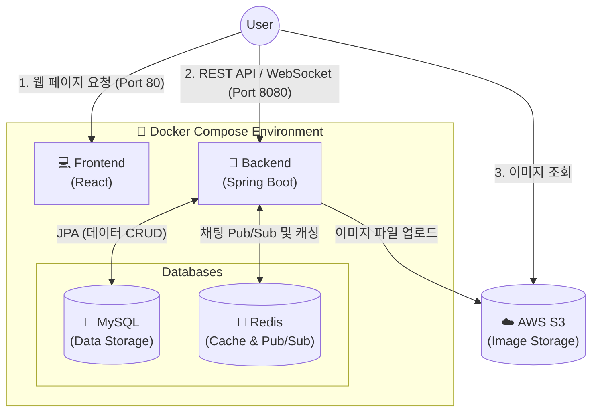

# 🍋 Lemon 영어회화 플랫폼
데일리 영어 회화 표현을 피드로 공유하고 채팅으로 연습할 수 있는 _🍋레몬 영어회화 플랫폼_입니다.
공유하고 싶은 영어 표현을 게시하고, 팀원들과 표현을 자유롭게 연습해볼 수 있습니다.


## Back-end 소개

- **Spring Boot 서버 구축 및 MVC 패턴 적용**
  Java Spring Boot를 이용해 백엔드 서버를 구축하고, `Controller - Service - Repository`로 이어지는 기본적인 MVC 구조를 적용함.
  
- **용도에 맞춘 DB 활용 (MySQL & Redis)**
  - **MySQL**: 유저, 게시글, 댓글 등 애플리케이션의 주요 데이터를 저장.
  - **Redis**: 채팅 기능에 Pub/Sub 메시지 브로커로 활용해 추후 서비스 확장을 고려함. 또한, 중복 요청 방어 및 멱등성 보장을 위해 UUID 캐싱 및 검증 로직을 구현함.

- **기획부터 배포까지 1인 풀스택 개발**
  초기 프로젝트 세팅부터 DB 설계, REST API 서버 개발, React 프론트엔드 연동까지 전 과정을 직접 구현함.

- **Docker Compose를 활용한 인프라 배포**
  AWS EC2 환경에서 Docker Compose를 사용해 프론트엔드, 백엔드, MySQL, Redis를 각각의 독립된 컨테이너로 배포함. 이미지 등 미디어 파일은 서버 용량 부하를 줄이기 위해 AWS S3와 연동함.

## 개발 인원 및 기간

- 개발기간 : 2026-05-29 ~ 2026-08-09
- 개발 인원 : 백엔드/프론트엔드 1명 (본인)

## 사용 기술 및 도구
### BE
- **Framework** : Java, Spring Boot, Spring Security, Spring Data JPA
- **Architecture** : MVC Pattern, RESTful API
- **Real-Time** : WebSocket (STOMP), Redis Pub/Sub
### Database & Storage
- **RDBMS** : MySQL 8.0
- **NoSQL / Cache** : Redis
- **Cloud Storage** : AWS S3
### Infrastructure & DevOps
- **Cloud Service** : AWS EC2
- **Containerization** : Docker, Docker Compose
  > 💡 **Docker 컨테이너 구성 (총 4개)**: 
  > 전체 시스템은 `React(프론트엔드)`, `Spring Boot(백엔드)`, `MySQL(DB)`, `Redis(캐시 및 브로커)` 4개의 컨테이너로 완벽히 분리되어 구동됩니다.

## Front-end

- [프론트앤드 레포는 여기](https://github.com/Rainwoorimforest/lemon-community-FE)

## 서비스 시연 영상

- 

## 폴더 구조
<details>
<summary><b>📂 백엔드 폴더 구조 보기 (Spring Boot)</b></summary>
<div markdown="1">

```text
📦 jpa_practice (Backend)
 ┣ 📂 src
 ┃ ┣ 📂 main
 ┃ ┃ ┣ 📂 java/kr/adapterz/jpa_practice
 ┃ ┃ ┃ ┣ 📂 config           # CORS, WebSocket 등 설정 클래스 모음
 ┃ ┃ ┃ ┣ 📂 controller       # REST API 엔드포인트 (ChatRoom, Post, User 등)
 ┃ ┃ ┃ ┣ 📂 dto              # 클라이언트 요청/응답 데이터 전송 객체 (DTO)
 ┃ ┃ ┃ ┣ 📂 entity           # JPA 엔티티 클래스 (DB 테이블 매핑)
 ┃ ┃ ┃ ┣ 📂 exception        # 커스텀 예외 클래스 및 전역 에러 처리 (GlobalExceptionHandler)
 ┃ ┃ ┃ ┣ 📂 handler          # 웹소켓(WebSocket) 및 기타 핸들러
 ┃ ┃ ┃ ┣ 📂 jwt              # JWT 토큰 생성, 검증 로직 및 필터
 ┃ ┃ ┃ ┣ 📂 redis            # Redis 캐싱 및 세션 관리 설정
 ┃ ┃ ┃ ┣ 📂 repository       # Spring Data JPA 리포지토리 인터페이스 (DB 접근)
 ┃ ┃ ┃ ┣ 📂 response         # API 공통 응답 포맷 (통일된 JSON 응답 반환)
 ┃ ┃ ┃ ┣ 📂 security         # Spring Security 설정 (BCrypt 등 암호화/인증)
 ┃ ┃ ┃ ┣ 📂 service          # 핵심 비즈니스 로직 처리 (ChatRoom, Post, User 등)
 ┃ ┃ ┃ ┗ 📜 JpaPracticeApplication.java # 스프링 부트 실행 진입점
 ┃ ┃ ┗ 📂 resources
 ┃ ┃   ┗ 📜 application.yml  # 데이터베이스 연결, JWT 비밀키 등 환경 설정
 ┣ 📜 build.gradle           # 의존성 라이브러리 및 빌드 관리 파일
 ┗ 📜 README.md
```
</details>

## 시스템 아키텍처 (System Architecture)

 
전체 시스템은 **Docker Compose**를 통해 컨테이너화되어 배포 및 관리됩니다.



## ERD


### 서버 구조

Spring Boot 환경에 맞추어 API 경로(Route), Controller, Entity(Model)를 구조화하였습니다.

| | Route (API 경로) | Controller | Entity (Model) |
| --- | --- | --- | --- |
| **유저** | `/users` | `UserController` | `User` |
| **게시글** | `/posts` | `PostController` | `Post` |
| **댓글** | `/comments` | `CommentController` | `Comment` |
| **좋아요** | `/likes` | `LikeController` | `Like` |
| **채팅** | `/chatrooms`, `/messages` | `ChatRoomController`, `MessageController`| `ChatRoom`, `Chat` |
| **이미지** | `/images` | `ImageController` | `PostImage` |

<br>

### 구현 기능

#### Users
- **유저 CRUD 기능 구현**: 내 정보 조회, 회원가입, 회원정보 수정, 탈퇴 등
- **비밀번호 암호화**: 회원가입, 로그인, 비밀번호 변경 시 Spring Security의 `BCryptPasswordEncoder`를 사용하여 비밀번호를 안전하게 암호화 및 검증 처리
- **JWT 기반 인증**: 기존 세션 방식 대신 JWT(JSON Web Token)를 발급하여 쿠키(Cookie)에 저장하고 상태 저장 없이(Stateless) 유저 인증 유지
- **Security 미들웨어**: Spring Security와 커스텀 `JwtFilter`를 통해 유효한 토큰을 가진 유저 요청만 처리
- **이미지 업로드**: 프로필 이미지는 서버가 아닌 **AWS S3**에 업로드하여 저장하고, DB에는 반환된 이미지 URL만 저장하여 관리

#### Posts
- **게시글 CRUD 기능 구현**: 게시글 작성, 조회, 수정, 삭제 기능
- **인증된 접근 제어**: Security Context(`@AuthenticationPrincipal`)를 활용해 인증된 유저만 게시글 작성 및 본인 글 수정/삭제 가능하도록 처리
- **이미지 연동**: 다중 파일(MultipartFile) 업로드를 통해 S3에 게시글 이미지를 저장하고 Post와 매핑

#### Comments / Likes / Chat
- **댓글**: 게시글에 대한 댓글 작성, 수정, 삭제 등 댓글 CRUD 기능
- **좋아요**: 게시글 등에 대한 좋아요(Like) 추가 및 취소 기능
- **실시간 채팅**: WebSocket 및 Redis Pub/Sub 등을 활용한 채팅방 생성 및 실시간 메시지 송수신 기능

### 데이터베이스설계

## 트러블 슈팅
- [엔티티 연관관계 편의 메소드를 써야할때는?]()
- [cascade와 orphanremoval도 tradeoff]()


## 회고
..
