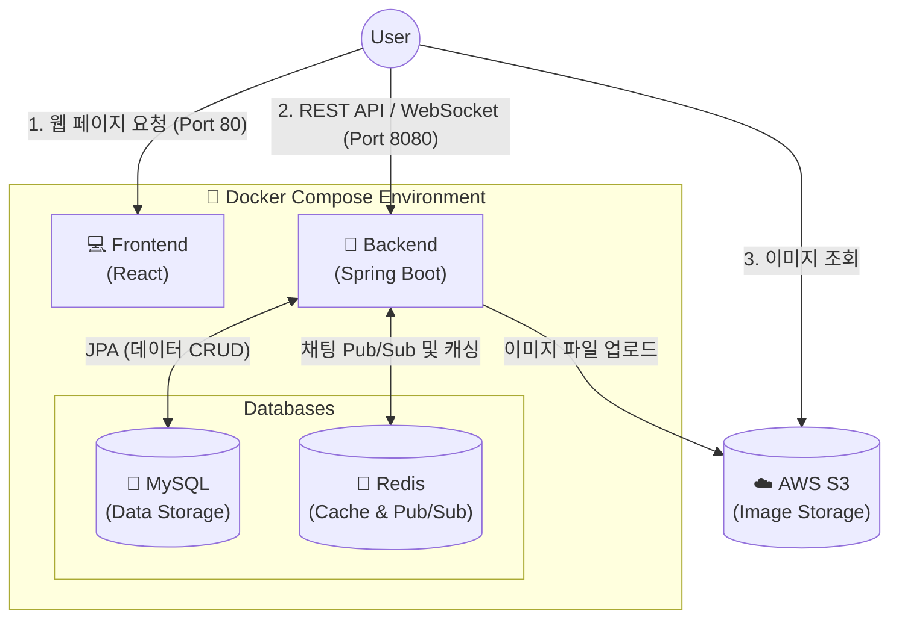

# 🍋 Lemon 영어회화 플랫폼
데일리 영어 회화 표현을 피드로 공유하고 채팅으로 연습할 수 있는 🍋레몬 영어회화 플랫폼입니다.
공유하고 싶은 영어 표현을 게시하고, 팀원들과 표현을 자유롭게 연습해볼 수 있습니다.


## Back-end 소개

- **Spring Boot 서버 구축 및 MVC 패턴 적용**
  Java Spring Boot를 이용해 백엔드 서버를 구축하고, `Controller - Service - Repository`로 이어지는 기본적인 MVC 구조를 적용함.
  
- **용도에 맞춘 DB 활용 (MySQL & Redis)**
  - **MySQL**: 유저, 게시글, 댓글 등 애플리케이션의 주요 데이터를 저장.
  - **Redis**: 채팅 기능에 Pub/Sub 메시지 브로커로 활용해 추후 서비스 확장을 고려함. 또한, 중복 요청 방어 및 멱등성 보장을 위해 UUID 캐싱 및 검증 로직을 구현함.

- **기획부터 배포까지 1인 풀스택 개발**
  초기 프로젝트 세팅부터 DB 설계, REST API 서버 개발, React 프론트엔드 연동까지 전 과정을 직접 구현함.

- **Docker Compose를 활용한 인프라 배포**
  AWS EC2 환경에서 Docker Compose를 사용해 프론트엔드, 백엔드, MySQL, Redis를 각각의 독립된 컨테이너로 배포함. 이미지 등 미디어 파일은 서버 용량 부하를 줄이기 위해 AWS S3와 연동함.

## 개발 인원 및 기간

- 개발기간 : 2026-05-29 ~ 2026-08-09
- 개발 인원 : 백엔드/프론트엔드 1명 (본인)

## 사용 기술 및 도구
### BE
- **Framework** : Java, Spring Boot, Spring Security, Spring Data JPA
- **Architecture** : MVC Pattern, RESTful API
- **Real-Time** : WebSocket (STOMP), Redis Pub/Sub
### Database & Storage
- **RDBMS** : MySQL 8.0
- **NoSQL / Cache** : Redis
- **Cloud Storage** : AWS S3
### Infrastructure & DevOps
- **Cloud Service** : AWS EC2
- **Containerization** : Docker, Docker Compose
  > 💡 **Docker 컨테이너 구성 (총 4개)**: 
  > 전체 시스템은 `React(프론트엔드)`, `Spring Boot(백엔드)`, `MySQL(DB)`, `Redis(캐시 및 브로커)` 4개의 컨테이너로 완벽히 분리되어 구동됩니다.

## Front-end

- [프론트앤드 레포는 여기](https://github.com/Rainwoorimforest/lemon-community-FE)

## 서비스 시연 영상

- 

## 폴더 구조
<details>
<summary><b>📂 백엔드 폴더 구조 보기 (Spring Boot)</b></summary>
<div markdown="1">

```text
📦 jpa_practice (Backend)
 ┣ 📂 src
 ┃ ┣ 📂 main
 ┃ ┃ ┣ 📂 java/kr/adapterz/jpa_practice
 ┃ ┃ ┃ ┣ 📂 config           # CORS, WebSocket 등 설정 클래스 모음
 ┃ ┃ ┃ ┣ 📂 controller       # REST API 엔드포인트 (ChatRoom, Post, User 등)
 ┃ ┃ ┃ ┣ 📂 dto              # 클라이언트 요청/응답 데이터 전송 객체 (DTO)
 ┃ ┃ ┃ ┣ 📂 entity           # JPA 엔티티 클래스 (DB 테이블 매핑)
 ┃ ┃ ┃ ┣ 📂 exception        # 커스텀 예외 클래스 및 전역 에러 처리 (GlobalExceptionHandler)
 ┃ ┃ ┃ ┣ 📂 handler          # 웹소켓(WebSocket) 및 기타 핸들러
 ┃ ┃ ┃ ┣ 📂 jwt              # JWT 토큰 생성, 검증 로직 및 필터
 ┃ ┃ ┃ ┣ 📂 redis            # Redis 캐싱 및 세션 관리 설정
 ┃ ┃ ┃ ┣ 📂 repository       # Spring Data JPA 리포지토리 인터페이스 (DB 접근)
 ┃ ┃ ┃ ┣ 📂 response         # API 공통 응답 포맷 (통일된 JSON 응답 반환)
 ┃ ┃ ┃ ┣ 📂 security         # Spring Security 설정 (BCrypt 등 암호화/인증)
 ┃ ┃ ┃ ┣ 📂 service          # 핵심 비즈니스 로직 처리 (ChatRoom, Post, User 등)
 ┃ ┃ ┃ ┗ 📜 JpaPracticeApplication.java # 스프링 부트 실행 진입점
 ┃ ┃ ┗ 📂 resources
 ┃ ┃   ┗ 📜 application.yml  # 데이터베이스 연결, JWT 비밀키 등 환경 설정
 ┣ 📜 build.gradle           # 의존성 라이브러리 및 빌드 관리 파일
 ┗ 📜 README.md
```
</details>

## 시스템 아키텍처 (System Architecture)

 
전체 시스템은 **Docker Compose**를 통해 컨테이너화되어 배포 및 관리됩니다.



## ERD


### 서버 구조

Spring Boot 환경에 맞추어 API 경로(Route), Controller, Entity(Model)를 구조화하였습니다.

| | Route (API 경로) | Controller | Entity (Model) |
| --- | --- | --- | --- |
| **유저** | `/users` | `UserController` | `User` |
| **게시글** | `/posts` | `PostController` | `Post` |
| **댓글** | `/comments` | `CommentController` | `Comment` |
| **좋아요** | `/likes` | `LikeController` | `Like` |
| **채팅** | `/chatrooms`, `/messages` | `ChatRoomController`, `MessageController`| `ChatRoom`, `Chat` |
| **이미지** | `/images` | `ImageController` | `PostImage` |

<br>

### 구현 기능

#### Users
- **유저 CRUD 기능 구현**: 내 정보 조회, 회원가입, 회원정보 수정, 탈퇴 등
- **비밀번호 암호화**: 회원가입, 로그인, 비밀번호 변경 시 Spring Security의 `BCryptPasswordEncoder`를 사용하여 비밀번호를 안전하게 암호화 및 검증 처리
- **JWT 기반 인증**: 기존 세션 방식 대신 JWT(JSON Web Token)를 발급하여 쿠키(Cookie)에 저장하고 상태 저장 없이(Stateless) 유저 인증 유지
- **Security 미들웨어**: Spring Security와 커스텀 `JwtFilter`를 통해 유효한 토큰을 가진 유저 요청만 처리
- **이미지 업로드**: 프로필 이미지는 서버가 아닌 **AWS S3**에 업로드하여 저장하고, DB에는 반환된 이미지 URL만 저장하여 관리

#### Posts
- **게시글 CRUD 기능 구현**: 게시글 작성, 조회, 수정, 삭제 기능
- **인증된 접근 제어**: Security Context(`@AuthenticationPrincipal`)를 활용해 인증된 유저만 게시글 작성 및 본인 글 수정/삭제 가능하도록 처리
- **이미지 연동**: 다중 파일(MultipartFile) 업로드를 통해 S3에 게시글 이미지를 저장하고 Post와 매핑

#### Comments / Likes / Chat
- **댓글**: 게시글에 대한 댓글 작성, 수정, 삭제 등 댓글 CRUD 기능
- **좋아요**: 게시글 등에 대한 좋아요(Like) 추가 및 취소 기능
- **실시간 채팅**: WebSocket 및 Redis Pub/Sub 등을 활용한 채팅방 생성 및 실시간 메시지 송수신 기능

### 데이터베이스설계

## 트러블 슈팅
- [엔티티 연관관계 편의 메소드를 써야할때는?]()
- [cascade와 orphanremoval도 tradeoff]()


## 회고
ERD 설계와 기획의 견고함이 얼마나 중요한지 알게 된 프로젝트입니다. 초기에 API 설계 방향성을 못 잡아서 이후에 Controller와 DTO를 몇 번이고 수정해야 했습니다. 초기에 기획이 정확하지 않으니 프로젝트를 진행하는 본인도 자주 변하는 프로젝트 구조에 헷갈리곤 하였습니다. 결국 프론트엔드와 백엔드를 안정적으로 설계하려면 초기부터 끝을 생각하고 기획해야 한다는 교훈을 얻었습니다.

프로젝트 초기에 필요한 엔티티는 무엇인지, 엔티티 간 연관관계나 병목은 없는지(JPA에서 One-to-One 지양 등) DB 설계에 대해 더 깊게 알아갈 수 있었습니다. 특히 JPA 영속성 컨텍스트의 1차 캐시를 이용해 게시글을 생성할 때 postId를 캐시에서 가져와 채팅방 생성과 동시에 INSERT 할 때나(트랜잭션 전파), 지연 로딩에서의 프록시를 유의하며 연관관계를 매핑할 때, 그리고 연관관계 편의 메소드를 써야 할 때와 안 써도 될 때 등 엔티티와 JPA 개념을 정확히 이해하며 설계하는 부분이 처음에는 어렵고 큰 주제였습니다. 하지만 하나씩 차근차근 소주제 개념들을 매핑해 나가니 논리적으로 코드를 작성하고 성능에 유리한 로직이 무엇인지 고민하는 물꼬를 트는 방법을 알게 된 것 같습니다. (여기는 백엔드의 심연이라 생각해서 아직 배울 점이 많다고 생각합니다.)

초기에 MVC 패턴이 와닿지 않았는데 프로젝트 규모가 커질수록 구조화된 설계의 편리함을 느꼈습니다. 예를 들어, 이미지를 업로드하는 컨트롤러에서 의존성 주입으로 서비스가 작성되어 있고, 그 서비스가 프로필 이미지인지 게시글 이미지인지 자세한 비즈니스 로직을 몰라도 어차피 S3 URL을 반환하게 됩니다. 프로필 이미지를 처리하는 서비스나 게시글 이미지를 처리하는 서비스에서 해당 S3 Service만 주입받아 사용하면 되니, 패턴 분리가 주는 편안함을 알 수 있었습니다.

인증/인가 구현은 한 번쯤 꼭 해봐야 하는 것 같습니다. 서버에 부담이 덜 가는 쿠키 방식을 택하더라도 그 트레이드오프를 생각해야 합니다. CSRF 공격 위험이 있으니 SameSite 속성 설정이나 CSRF 토큰 발급으로 방어해야 합니다. 초기에는 URL에 userId를 직접 넣어 스프링에서 equal 비교를 하며 로그인한 유저를 확인했는데, 이는 userId를 임의로 조작할 수 있어 보안상 취약했습니다. 그래서 JWT와 @AuthenticationPrincipal 어노테이션을 도입하여 조금 더 자바 스프링스럽게 해결할 수 있었습니다.

캐시, 스토리지 등 브라우저가 보관할 수 있는 메모리와 서버-클라이언트 통신 시 래퍼처럼 감쌀 수 있는 수단(세션, 쿠키)이 실제 HTTP 통신 어디에 들어가는지 등 네트워크 이론상으로만 알고 있던 것을 코드로 직접 작성하며 이해하는 시간이었습니다. 서비스가 커지면서 회원 정보를 어떻게 저장할지, 혹은 자주 조회되지만 서비스상 그렇게 중요하지 않은 '조회수' 같은 데이터는 어떻게 효율적으로 처리해야 할지 앞으로 더 깊게 고민해 봐야겠다고 체크해 둔 부분입니다.

AWS+Docker 배포와 CI/CD를 처음 해봤는데요. 도커 컴포즈의 환경 변수가 깃허브에 푸시되지 않도록 2번, 3번, 4번 거듭 확인해야 한다는 걸 뼈저리게 기억하게 되었습니다. 이는 진짜 큰 사고가 될 수 있기 때문에 기술적인 내용 못지않게 협업에서도 중요하다고 생각합니다. 카테캠 현직자 멘토링에서 들었듯, 커밋 메시지와 PR을 정해진 형식에 맞춰 깔끔하게 적는 것이 좋을 것 같습니다.

아쉬운 점은 예외 처리를 더 세밀하게 나누지 못한 것입니다. 그래서 디버깅할 때 조금 불편합니다.

그래도 한 번 이렇게 '우당탕탕' 부딪히며 만들어보는 경험이 정말 중요한 것 같습니다. 기존 API가 계속 바뀌었던 입장에서, /api/... 처럼 통일되지 않아 겪는 프록시 오류나 불필요하게 URL에 들어가는 userId 등 API 설계가 프로젝트 처음부터 끝까지 제일 중요하다는 걸 느꼈습니다. 또한 DB 엔티티 설계 시 연관관계 매핑에서 중요하게 생각해야 하는 것, 하나의 트랜잭션 범위, 의존성 주입의 효율성을 몸소 체감할 수 있었습니다. 이후 두 번째 프로젝트부터는 ApiResponse 공통화, 예외 처리, MVC 구조, 인증/인가, AWS 배포처럼 어느 정도 뼈대를 잡는 작업에서 시간을 아끼고, DB N+1 문제 해결, 보안 취약점 보완, 복잡한 엔티티 설계 등 진짜 시간을 써야 하는 깊이 있는 부분에 집중할 수 있을 것 같습니다.
